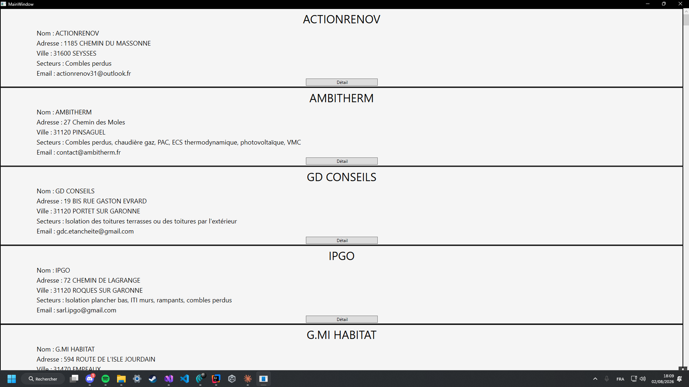

rge-list
========

Dépôt
-----

https://github.com/luc2/rge-list

Branche actuelle : `feat/ratings`

(c'est le bordel de ce projet)

Objectif
--------

### Étape 1

Nous avons le PDF suivant : `Liste entreprises RGE Muretain Agglo 202602.pdf`.

Il faut juste **extraire les données** de ce PDF.

On va demander à l'IA de nous aider, et on sait d'avance qu'elle va nous énerver à mort.

Résultat :

- `entreprises_rge.csv`
- `entreprises_rge.json`

Mais malheureusement, j'ai perdu le code source :)

### Étape 2

Récupérer des **évaluations** sur ces entreprises, afin de choisir les meilleures pour leur demander un devis pour la réparation de la fenêtre... de quelle fenêtre je parle ? ÇA NE VOUS REGARDE PAS !!!!

Où récupérer des évaluations ? Euh... de **Google Maps** je pense...

Stream
------

### Lundi 17 Août 2026

**OpenCode**, c'est excellent :

```
$ curl -fsSL https://opencode.ai/install | bash
curl: (22) The requested URL returned error: 429
```

- `opencode-desktop-linux-amd64.deb`

```
$ opencode
opencode : commande introuvable
$ find / -iname opencode 2>/dev/null
$ cd /opt/OpenCode
$ ./ai.opencode.desktop 
```

Pendant la discussion, ce connard m'a installé **OpenCode Terminal** sans que je le demande...

### Dimanche 2 Août 2026

1. Monsieur Shape581 tente de le faire en C#...



2. Je me suis dégonflé sur l'extraction PDF, j'ai perdu trop de temps avec ça, comme j'ai déjà les données en CSV et JSON, je vais les utiliser, même si j'ai perdu le code source qui permet de les extraire.

### Vendredi 10 Juillet 2026

friendly_0day me parle de l'ia GLM. La preuve :

- 16:47 ?friendly_0day: quand tu vois les bench de GLM5.2 de z.ai ils ont 6 mois de retard max
- 16:48 ?friendly_0day: sur chat.z.ai
- 16:48 ?friendly_0day: c'est l'ia GLM
- 16:49 ?friendly_0day: ia chinese
- 16:50 ?friendly_0day: tu fais de l'info depuis longtemps ?

### Jeudi 9 Juillet 2026

Mon micro est à chier, je vais tester le **micro de ma barre de son** : Zéro filtre OBS, ça va être infernal.

- 17:26 'MILKAA9801: Salut frérot !
- 17:26 ~Lucdeux: salut
- 17:27 ~Lucdeux: dis-moi si mon micro est à chier
- 17:27 MILKAA9801: Ouais un peu, c'est dommage
- 17:28 ~Lucdeux: je viens d'activer le filtre anti-bruit, ça va mieux ou pas ?
- 17:28 MILKAA9801: C'est un peu mieux, mais je te conseille de baisser le son de la musique pour entendre ta voix clairement. On entend ta voix comme si t'étais loin.

Développement
-------------

### uv

```
uv init
uv run main.py
```

### IA

- Copilot = Quota épuisé
- Antigravity = Quota épuisé
- Cursor = Quota épuisé
- Claude Code = Pas de formule gratuite
- Cline = En cours de test, activable sur la barre gauche de VS Code
    + Thinking... = Freezé = Nul = Indigne de 2026. Il devrait timeout pour relancer, ou alors, timeout pour me prévenir.

### TODO

- La prochaine fois, mettre le code en public sur Github pour se prendre des Pull Requests.
